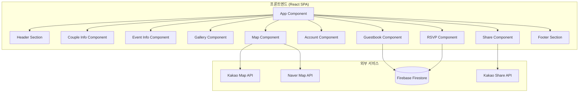

# 설계 문서: 모바일 청첩장

## 개요

모바일 청첩장은 React 기반의 싱글 페이지 애플리케이션(SPA)으로, 결혼식 정보를 아름답고 사용하기 쉬운 형태로 제공합니다. 모바일 우선 반응형 디자인을 적용하며, 백엔드는 Firebase를 활용하여 방명록과 RSVP 데이터를 관리합니다.

## 아키텍처



## 컴포넌트 및 인터페이스

### 1. 데이터 설정 인터페이스

```typescript
// 청첩장 전체 설정
interface WeddingConfig {
  couple: CoupleConfig;
  event: EventConfig;
  gallery: GalleryConfig;
  location: LocationConfig;
  accounts: AccountConfig;
  guestbook: GuestbookConfig;
  rsvp: RsvpConfig;
  share: ShareConfig;
  theme: ThemeConfig;
}

// 신랑/신부 정보
interface CoupleConfig {
  groom: PersonInfo;
  bride: PersonInfo;
  greeting: string;
}

interface PersonInfo {
  name: string;
  englishName?: string;
  father: ParentInfo;
  mother: ParentInfo;
  phone?: string;
}

interface ParentInfo {
  name: string;
  phone?: string;
  relation: '장남' | '차남' | '삼남' | '장녀' | '차녀' | '삼녀' | string;
}

// 결혼식 정보
interface EventConfig {
  date: string; // ISO 8601 format
  time: string; // HH:mm format
  venueName: string;
  hallName?: string;
  calendarEnabled: boolean;
}

// 갤러리 설정
interface GalleryConfig {
  images: GalleryImage[];
  layout: 'grid' | 'slider';
}

interface GalleryImage {
  id: string;
  url: string;
  alt: string;
  order: number;
}

// 위치 정보
interface LocationConfig {
  address: string;
  detailAddress?: string;
  coordinates: {
    lat: number;
    lng: number;
  };
  transportation?: {
    subway?: string;
    bus?: string;
    car?: string;
    parking?: string;
  };
}

// 계좌 정보
interface AccountConfig {
  groom: BankAccount[];
  bride: BankAccount[];
}

interface BankAccount {
  bank: string;
  accountNumber: string;
  holder: string;
  kakaoPayLink?: string;
}

// 방명록 설정
interface GuestbookConfig {
  enabled: boolean;
  maxLength: number;
}

// RSVP 설정
interface RsvpConfig {
  enabled: boolean;
  mealOption: boolean;
  deadline?: string;
}

// 공유 설정
interface ShareConfig {
  kakaoEnabled: boolean;
  kakaoAppKey?: string;
  ogImage?: string;
  ogTitle?: string;
  ogDescription?: string;
}

// 테마 설정
interface ThemeConfig {
  primaryColor: string;
  fontFamily: string;
  backgroundImage?: string;
}
```

### 2. 방명록 데이터 모델

```typescript
interface GuestbookMessage {
  id: string;
  name: string;
  passwordHash: string;
  message: string;
  createdAt: Date;
}

interface GuestbookInput {
  name: string;
  password: string;
  message: string;
}
```

### 3. RSVP 데이터 모델

```typescript
interface RsvpResponse {
  id: string;
  name: string;
  phone: string;
  attending: boolean;
  guestCount: number;
  mealAttending?: boolean;
  message?: string;
  createdAt: Date;
}

interface RsvpInput {
  name: string;
  phone: string;
  attending: boolean;
  guestCount: number;
  mealAttending?: boolean;
  message?: string;
}
```

### 4. 컴포넌트 Props 인터페이스

```typescript
// CoupleInfo Component
interface CoupleInfoProps {
  config: CoupleConfig;
}

// EventInfo Component
interface EventInfoProps {
  config: EventConfig;
}

// Gallery Component
interface GalleryProps {
  config: GalleryConfig;
}

// Map Component
interface MapProps {
  config: LocationConfig;
}

// Account Component
interface AccountProps {
  config: AccountConfig;
}

// Guestbook Component
interface GuestbookProps {
  config: GuestbookConfig;
  messages: GuestbookMessage[];
  onSubmit: (input: GuestbookInput) => Promise<void>;
  onDelete: (id: string, password: string) => Promise<void>;
}

// RSVP Component
interface RsvpProps {
  config: RsvpConfig;
  onSubmit: (input: RsvpInput) => Promise<void>;
}

// Share Component
interface ShareProps {
  config: ShareConfig;
  url: string;
}
```

## 데이터 모델

### Firebase Firestore 구조

```
/weddings/{weddingId}/
  - config: WeddingConfig
  - guestbook/
    - {messageId}: GuestbookMessage
  - rsvp/
    - {responseId}: RsvpResponse
```

### 상태 관리

```typescript
// 애플리케이션 상태
interface AppState {
  config: WeddingConfig | null;
  guestbookMessages: GuestbookMessage[];
  isLoading: boolean;
  error: string | null;
}

// 갤러리 모달 상태
interface GalleryModalState {
  isOpen: boolean;
  currentIndex: number;
}

// 폼 상태
interface FormState<T> {
  data: T;
  errors: Record<string, string>;
  isSubmitting: boolean;
}
```


## 주요 기능 구현

### 1. D-Day 카운트다운 계산

```typescript
function calculateDDay(eventDate: string): DdayResult {
  const event = new Date(eventDate);
  const today = new Date();
  today.setHours(0, 0, 0, 0);
  event.setHours(0, 0, 0, 0);
  
  const diffTime = event.getTime() - today.getTime();
  const diffDays = Math.ceil(diffTime / (1000 * 60 * 60 * 24));
  
  return {
    days: Math.abs(diffDays),
    isPast: diffDays < 0,
    isToday: diffDays === 0
  };
}

interface DdayResult {
  days: number;
  isPast: boolean;
  isToday: boolean;
}
```

### 2. 캘린더 추가 기능

```typescript
function generateCalendarUrl(event: EventConfig, location: LocationConfig): string {
  const startDate = new Date(`${event.date}T${event.time}`);
  const endDate = new Date(startDate.getTime() + 2 * 60 * 60 * 1000); // 2시간 후
  
  const formatDate = (date: Date) => 
    date.toISOString().replace(/[-:]/g, '').split('.')[0] + 'Z';
  
  const params = new URLSearchParams({
    action: 'TEMPLATE',
    text: `${event.venueName} 결혼식`,
    dates: `${formatDate(startDate)}/${formatDate(endDate)}`,
    location: location.address,
    details: `${event.hallName || ''}`
  });
  
  return `https://calendar.google.com/calendar/render?${params}`;
}
```

### 3. 클립보드 복사 기능

```typescript
async function copyToClipboard(text: string): Promise<CopyResult> {
  try {
    if (navigator.clipboard && navigator.clipboard.writeText) {
      await navigator.clipboard.writeText(text);
      return { success: true };
    }
    // Fallback for older browsers
    const textArea = document.createElement('textarea');
    textArea.value = text;
    textArea.style.position = 'fixed';
    textArea.style.left = '-9999px';
    document.body.appendChild(textArea);
    textArea.select();
    document.execCommand('copy');
    document.body.removeChild(textArea);
    return { success: true };
  } catch (error) {
    return { success: false, error: String(error) };
  }
}

interface CopyResult {
  success: boolean;
  error?: string;
}
```

### 4. 비밀번호 해싱

```typescript
async function hashPassword(password: string): Promise<string> {
  const encoder = new TextEncoder();
  const data = encoder.encode(password);
  const hashBuffer = await crypto.subtle.digest('SHA-256', data);
  const hashArray = Array.from(new Uint8Array(hashBuffer));
  return hashArray.map(b => b.toString(16).padStart(2, '0')).join('');
}

async function verifyPassword(password: string, hash: string): Promise<boolean> {
  const inputHash = await hashPassword(password);
  return inputHash === hash;
}
```

### 5. 방명록 유효성 검사

```typescript
interface ValidationResult {
  isValid: boolean;
  errors: Record<string, string>;
}

function validateGuestbookInput(input: GuestbookInput): ValidationResult {
  const errors: Record<string, string> = {};
  
  if (!input.name || input.name.trim().length === 0) {
    errors.name = '이름을 입력해주세요';
  }
  
  if (!input.password || input.password.length < 4) {
    errors.password = '비밀번호는 4자 이상이어야 합니다';
  }
  
  if (!input.message || input.message.trim().length === 0) {
    errors.message = '메시지를 입력해주세요';
  }
  
  return {
    isValid: Object.keys(errors).length === 0,
    errors
  };
}
```

### 6. RSVP 유효성 검사

```typescript
function validateRsvpInput(input: RsvpInput): ValidationResult {
  const errors: Record<string, string> = {};
  
  if (!input.name || input.name.trim().length === 0) {
    errors.name = '이름을 입력해주세요';
  }
  
  if (!input.phone || !/^01[0-9]-?[0-9]{3,4}-?[0-9]{4}$/.test(input.phone)) {
    errors.phone = '올바른 연락처를 입력해주세요';
  }
  
  if (input.attending && input.guestCount < 1) {
    errors.guestCount = '참석 인원을 선택해주세요';
  }
  
  return {
    isValid: Object.keys(errors).length === 0,
    errors
  };
}
```

### 7. 카카오톡 공유

```typescript
function shareToKakao(config: ShareConfig, url: string): void {
  if (!window.Kakao?.isInitialized()) {
    window.Kakao?.init(config.kakaoAppKey);
  }
  
  window.Kakao?.Share.sendDefault({
    objectType: 'feed',
    content: {
      title: config.ogTitle || '결혼식에 초대합니다',
      description: config.ogDescription || '',
      imageUrl: config.ogImage || '',
      link: {
        mobileWebUrl: url,
        webUrl: url
      }
    },
    buttons: [
      {
        title: '청첩장 보기',
        link: {
          mobileWebUrl: url,
          webUrl: url
        }
      }
    ]
  });
}
```

### 8. 지도 앱 연동

```typescript
function openNaverMap(lat: number, lng: number, name: string): void {
  const url = `nmap://place?lat=${lat}&lng=${lng}&name=${encodeURIComponent(name)}&appname=wedding-invitation`;
  const webUrl = `https://map.naver.com/v5/search/${encodeURIComponent(name)}`;
  
  window.location.href = url;
  setTimeout(() => {
    window.location.href = webUrl;
  }, 500);
}

function openKakaoMap(lat: number, lng: number, name: string): void {
  const url = `kakaomap://look?p=${lat},${lng}`;
  const webUrl = `https://map.kakao.com/link/map/${encodeURIComponent(name)},${lat},${lng}`;
  
  window.location.href = url;
  setTimeout(() => {
    window.location.href = webUrl;
  }, 500);
}
```


## 정확성 속성 (Correctness Properties)

*정확성 속성은 시스템의 모든 유효한 실행에서 참이어야 하는 특성 또는 동작입니다. 이는 사람이 읽을 수 있는 명세와 기계가 검증할 수 있는 정확성 보장 사이의 다리 역할을 합니다.*

### Property 1: D-Day 계산 정확성

*For any* 유효한 날짜에 대해, D-Day 계산 함수는 오늘 날짜와의 차이를 정확하게 계산해야 하며, 과거/현재/미래를 올바르게 구분해야 한다.

**Validates: Requirements 2.4**

### Property 2: 캘린더 URL 생성

*For any* 유효한 이벤트 설정(날짜, 시간, 장소)에 대해, 생성된 Google Calendar URL은 올바른 형식을 가지며 모든 필수 파라미터(날짜, 제목, 장소)를 포함해야 한다.

**Validates: Requirements 2.5**

### Property 3: 갤러리 네비게이션 인덱스

*For any* 갤러리 이미지 배열과 현재 인덱스에 대해, 다음/이전 네비게이션은 배열 범위 내에서 순환하며 유효한 인덱스를 반환해야 한다.

**Validates: Requirements 3.2, 3.3**

### Property 4: 지도 앱 URL 생성

*For any* 유효한 좌표(위도, 경도)와 장소명에 대해, 네이버 지도 및 카카오맵 URL은 올바른 형식을 가지며 좌표와 장소명을 포함해야 한다.

**Validates: Requirements 4.3, 4.4**

### Property 5: 클립보드 복사 라운드 트립

*For any* 문자열에 대해, 클립보드에 복사한 후 읽으면 원본 문자열과 동일해야 한다.

**Validates: Requirements 4.5, 5.2, 8.2**

### Property 6: 방명록 유효성 검사

*For any* 방명록 입력에 대해, 이름/비밀번호/메시지 중 하나라도 비어있거나 공백만 있으면 유효성 검사가 실패하고 해당 필드에 대한 오류 메시지를 반환해야 한다.

**Validates: Requirements 6.3**

### Property 7: 방명록 메시지 추가

*For any* 유효한 방명록 입력에 대해, 메시지를 추가하면 메시지 목록의 길이가 1 증가하고 추가된 메시지가 목록에 포함되어야 한다.

**Validates: Requirements 6.2**

### Property 8: 비밀번호 해싱 및 검증

*For any* 비밀번호 문자열에 대해, 해싱 후 동일한 비밀번호로 검증하면 true를 반환하고, 다른 비밀번호로 검증하면 false를 반환해야 한다.

**Validates: Requirements 6.4, 6.5, 10.4**

### Property 9: RSVP 유효성 검사

*For any* RSVP 입력에 대해, 이름이 비어있거나 연락처 형식이 잘못되었거나 참석 시 인원이 0 이하이면 유효성 검사가 실패하고 해당 필드에 대한 오류 메시지를 반환해야 한다.

**Validates: Requirements 7.4**

### Property 10: 데이터 저장 라운드 트립

*For any* 방명록 메시지 또는 RSVP 응답에 대해, 저장 후 조회하면 원본 데이터와 동일한 내용을 반환해야 한다.

**Validates: Requirements 10.1, 10.2**

### Property 11: 조건부 렌더링 일관성

*For any* 설정 데이터에 대해, 선택적 필드(연락처, 교통 안내, 카카오페이 링크, 식사 옵션)가 제공된 경우에만 해당 UI 요소가 렌더링되어야 한다.

**Validates: Requirements 1.4, 4.6, 5.4, 7.5**

## 오류 처리

### 네트워크 오류

```typescript
interface ApiError {
  code: 'NETWORK_ERROR' | 'SERVER_ERROR' | 'VALIDATION_ERROR' | 'NOT_FOUND';
  message: string;
  details?: Record<string, string>;
}

async function handleApiCall<T>(
  apiCall: () => Promise<T>,
  errorMessage: string
): Promise<{ data?: T; error?: ApiError }> {
  try {
    const data = await apiCall();
    return { data };
  } catch (error) {
    console.error(errorMessage, error);
    return {
      error: {
        code: 'NETWORK_ERROR',
        message: errorMessage
      }
    };
  }
}
```

### 사용자 피드백

- 로딩 상태: 스피너 또는 스켈레톤 UI 표시
- 성공 상태: 토스트 메시지로 성공 알림
- 오류 상태: 인라인 오류 메시지 또는 토스트로 오류 알림
- 빈 상태: 적절한 빈 상태 메시지 표시

### 폼 오류 처리

```typescript
function displayFormErrors(errors: Record<string, string>): void {
  Object.entries(errors).forEach(([field, message]) => {
    const element = document.querySelector(`[name="${field}"]`);
    if (element) {
      element.classList.add('error');
      const errorEl = element.nextElementSibling;
      if (errorEl?.classList.contains('error-message')) {
        errorEl.textContent = message;
      }
    }
  });
}
```

## 테스팅 전략

### 단위 테스트

단위 테스트는 특정 예제, 엣지 케이스, 오류 조건을 검증합니다.

**테스트 대상:**
- D-Day 계산 함수 (오늘, 과거, 미래 날짜)
- 캘린더 URL 생성 함수
- 클립보드 복사 함수
- 비밀번호 해싱/검증 함수
- 유효성 검사 함수 (방명록, RSVP)
- 지도 URL 생성 함수

**엣지 케이스:**
- 빈 문자열 입력
- 특수 문자가 포함된 입력
- 경계값 (D-Day 0일, 최대 인원 등)
- 잘못된 날짜 형식

### 속성 기반 테스트 (Property-Based Testing)

속성 기반 테스트는 무작위로 생성된 다양한 입력에 대해 보편적 속성을 검증합니다.

**테스트 프레임워크:** fast-check (TypeScript/JavaScript)

**설정:**
- 각 속성 테스트는 최소 100회 반복 실행
- 각 테스트는 설계 문서의 속성 번호를 태그로 포함
- 태그 형식: `Feature: mobile-wedding-invitation, Property {number}: {property_text}`

**속성 테스트 목록:**
1. D-Day 계산 정확성 (Property 1)
2. 캘린더 URL 생성 (Property 2)
3. 갤러리 네비게이션 인덱스 (Property 3)
4. 지도 앱 URL 생성 (Property 4)
5. 클립보드 복사 라운드 트립 (Property 5)
6. 방명록 유효성 검사 (Property 6)
7. 방명록 메시지 추가 (Property 7)
8. 비밀번호 해싱 및 검증 (Property 8)
9. RSVP 유효성 검사 (Property 9)
10. 데이터 저장 라운드 트립 (Property 10)
11. 조건부 렌더링 일관성 (Property 11)

### 통합 테스트

- Firebase Firestore 연동 테스트
- 카카오 SDK 연동 테스트
- 지도 API 연동 테스트

### 컴포넌트 테스트

- React Testing Library를 사용한 컴포넌트 렌더링 테스트
- 사용자 상호작용 시뮬레이션
- 접근성 테스트 (jest-axe)
